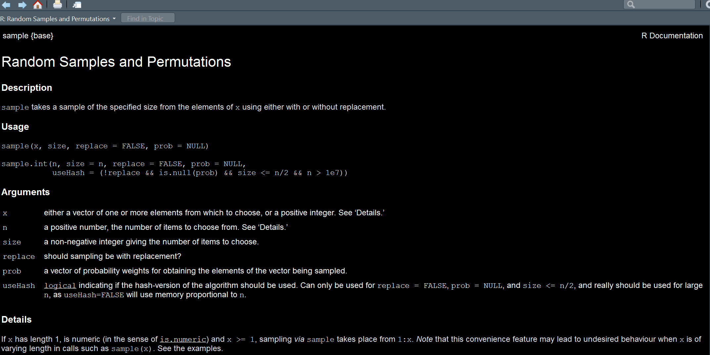

class: inverse

background-image: url(https://github.com/m-clark/m-clark.github.io/raw/master/img/Rlogo.svg)

```{r setup, include=FALSE}
options(htmltools.dir.version = FALSE, crayon.enabled = FALSE) # see https://github.com/hadley/mastering-shiny/issues/132

knitr::opts_chunk$set(
  # code
  echo      = T,
  eval      = F,
  message   = F,
  warning   = F,
  error     = F,
  comment   = NA,
  R.options = list(width = 220),
  # viz
  dev.args  = list(bg = 'transparent'),
  dev       = 'svglite',
  fig.align = 'center',
  out.width = '75%',
  fig.asp   = .75,
  # cache
  cache.rebuild = F,
  cache         = F
)

kable_df = function(data, digits=3, ...) {
  kableExtra::kable(
    data,
    digits = digits,
    format = 'html',
    booktabs = T,
    # longtable = F,
    linesep = "",
    ...,
  ) %>% 
    kableExtra::kable_styling(full_width = F)
}

perc = function(x, digits = 1) paste(rnd(x*100, digits = digits), '%')
```

```{r setup-extra, echo=FALSE, eval=TRUE}
# DOESN'T DISPLAY WITH INVERSE
xaringanExtra::use_xaringan_extra(c(
  "tile_view",
  "animate_css",
  "tachyons",
  'clipboard',
  'fit_screen',
  'webcam',
  'panelset'
))

xaringanExtra::use_logo(
  image_url = 'https://raw.githubusercontent.com/m-clark/m-clark.github.io/master/img/mc_logo.png', 
  link_url = 'https://m-clark.github.io',
  width = '5%', 
  position =  xaringanExtra::css_position(bottom = "-3em", left = "1em"),
  exclude_class = c("title-slide")
)

xaringanExtra::use_animate_css()

xaringanExtra::style_share_again(
  share_buttons = c("twitter", "linkedin", "pocket")
)
```


```{r setup-packs}
library(tidyverse)
```


---
class: inverse middle center


### *Basics*

### *Iterative Programming*

### *Writing Functions*

### *More*


---
class: inverse middle center animated rollIn rollOut # https://animate.style/


# Basics 
<br>
<br>
<i class="fas fa-laptop-code fa-5x"></i>

---
class: inverse center

# Basics: Objects


--

<br>

## What is an <span class="" style = "text-shadow: 0 0 50px #EBA42BFF">*object*</span>?

--
## Anything!

--

<div class="" style = "font-size:20pt">
data frames<br>

lists<br>

vectors<br>

matrices<br>

strings<br>

plots
</div>


---
class: inverse

# Basics: Objects

Everything in R revolves around the objects we create

```{r}
my_value = 'M'

my_vector = rnorm(100)

my_df = data.frame(A = rnorm(100), B = runif(100))

my_plot = qplot(A, B, data = my_df)

my_list = list(
  my_value,
  my_vector,
  my_df,
  my_plot
)

```


---
class: inverse 

# Basics: Objects

How do we understand them?

--

```{r eval=TRUE}
library(tidyverse)

glimpse(diamonds)
```

---
class: inverse 

# Basics: Objects

```{r eval=TRUE}
lm_mod = lm(mpg ~ ., data=mtcars)

str(lm_mod, 1)  # works for functions too! try str(lm)
```

---
class: inverse 

# Basics: Objects

*Classes* tell us the kind of object we're dealing with.

*Methods* work on different classes.

```{r}
class(diamonds)  # data.frame

summary(diamonds)

class(diamonds$clarity)   # ordered factor

summary(diamonds$clarity)

class(lm_mod)   # lm

summary(lm_mod)
```


---
class: inverse 

# Basics: Objects

```{r eval = T}
methods('summary')
```

---
class: inverse 

# Basics: Documentation

Use the <span class="func" style = "">sample</span> function to get a random sample of 10 values from the numbers 1 to 5. 

```{r help}
sample(?)
```

--
Don’t know what to put? 

--

Consult the help file!


---
class: inverse 

# Basics: Documentation



---
class: inverse 

# Basics: Exercises

With one function, find out what the class, number of rows, number of columns are of the following object, including what kind of object the last three columns are. Inspect the help file also.


```{r}
library(dplyr)

?starwars
```


---
class: inverse middle center


# Iterative Programming
<br>
<br>
<i class="fas fa-sync-alt fa-5x"></i>

---
class: inverse

# Iterative Programming: For Loops

Do you do something like this?

```{r}
means1 = mean(df$x)
means2 = mean(df$y)
means3 = mean(df$z)
means4 = mean(df$q)
```

--

<i class="far fa-times-circle fa-9x" style="position: relative; top: -200px; height: -500px; display: block"></i>

---
class: inverse

# Iterative Programming: For Loops

Write a *loop* instead!

```{r}
for (column in c('x','y','z','q')) {
  mean(df[[column]])
}
```

What’s going on here? 

--

We’ve created an iterative process in which:

--

*for* every *element* in `c('x','y','z','q')`... 

--

Do something!

---
class: inverse

# Iterative Programming: For Loops

```{r eval=T}
weather = nycflights13::weather

for (column in c('temp', 'humid', 'wind_speed', 'precip')) {
  print(mean(weather[[column]], na.rm = TRUE))
}
```


---
class: inverse

# Iterative Programming: Implicit Loops


---
class: inverse

# Iterative Programming: Looping with Lists


---
class: inverse

# Iterative Programming: Exercises


---
class: inverse middle  center

# Functions

<br>
<br>

<i class="fa fa-code fa-5x"></i>


---
class: inverse

# Functions: Starting Out


---
class: inverse

# Functions: DRY


---
class: inverse

# Functions: Conditionals


---
class: inverse

# Functions: Anonymous Functions


---
class: inverse

# Functions: Exercises


---
class: inverse 

# More

<br>
<br>
<i class="fab fa-r-project fa-5x"></i>

---
class: inverse

# More: Code Style


---
class: inverse

# More: Vectorization


---
class: inverse

# More: Regular Expressions


---
class: inverse

# More: Exercises


---
class: last-slide, inverse, center, middle


