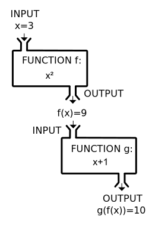

class: inverse

background-image: url(https://github.com/m-clark/m-clark.github.io/raw/master/img/Rlogo.svg)

```{r setup, include=FALSE}
options(htmltools.dir.version = FALSE, crayon.enabled = FALSE) # see https://github.com/hadley/mastering-shiny/issues/132

knitr::opts_chunk$set(
  # code
  echo      = T,
  eval      = F,
  message   = F,
  warning   = F,
  error     = F,
  comment   = NA,
  R.options = list(width = 220),
  # viz
  dev.args  = list(bg = 'transparent'),
  dev       = 'svglite',
  fig.align = 'center',
  out.width = '75%',
  fig.asp   = .75,
  # cache
  cache.rebuild = F,
  cache         = F
)

kable_df = function(data, digits=3, ...) {
  kableExtra::kable(
    data,
    digits = digits,
    format = 'html',
    booktabs = T,
    # longtable = F,
    linesep = "",
    ...,
  ) %>% 
    kableExtra::kable_styling(full_width = F)
}

perc = function(x, digits = 1) paste(rnd(x*100, digits = digits), '%')
```

```{r setup-extra, echo=FALSE, eval=TRUE}
xaringanExtra::use_xaringan_extra(
  c(
    "tile_view",
    "animate_css",
    "tachyons",
    'clipboard',
    'fit_screen',
    'webcam',
    'panelset'
  )
)

xaringanExtra::use_logo(
  image_url = 'https://raw.githubusercontent.com/m-clark/m-clark.github.io/master/img/mc_logo.png',
  link_url = 'https://m-clark.github.io',
  width = '5%',
  position =  xaringanExtra::css_position(bottom = "-3em", left = "1em"),
  exclude_class = c("title-slide")
)

xaringanExtra::use_animate_css()

xaringanExtra::style_share_again(
  share_buttons = c("twitter", "linkedin", "pocket")
)
```


```{r setup-packs}
library(tidyverse)
```


---
class: inverse middle center


### *Basics*

### *Iterative Programming*

### *Writing Functions*

### *More*


---
class: inverse middle center animated rollIn rollOut # https://animate.style/


# Basics 
<br>
<br>
<i class="fas fa-laptop-code fa-5x"></i>

---
class: inverse center

# Basics: Objects


--

<br>

## What is an <span class="" style = "text-shadow: 0 0 50px #EBA42BFF">*object*</span>?

--
## Anything!

--

<div class="" style = "font-size:20pt">
data frames<br>

lists<br>

vectors<br>

matrices<br>

strings<br>

plots
</div>


---
class: inverse

# Basics: Objects

Everything in R revolves around the objects we create

```{r}
my_value = 'M'

my_vector = rnorm(100)

my_df = data.frame(A = rnorm(100), B = runif(100))

my_plot = qplot(A, B, data = my_df)

my_list = list(
  my_value,
  my_vector,
  my_df,
  my_plot
)

```


---
class: inverse 

# Basics: Objects

How do we understand them?

--

```{r eval=TRUE}
library(tidyverse)

glimpse(diamonds)
```

---
class: inverse 

# Basics: Objects

```{r eval=TRUE}
lm_mod = lm(mpg ~ ., data=mtcars)

str(lm_mod, 1)  # works for functions too! try str(lm)
```

---
class: inverse 

# Basics: Objects

*Classes* tell us the kind of object we're dealing with.

*Methods* work on different classes.

```{r}
class(diamonds)  # data.frame

summary(diamonds)

class(diamonds$clarity)   # ordered factor

summary(diamonds$clarity)

class(lm_mod)   # lm

summary(lm_mod)
```


---
class: inverse 

# Basics: Objects

```{r eval = T}
methods('summary')
```

---
class: inverse 

# Basics: Documentation

Use the <span class="func" style = "">sample</span> function to get a random sample of 10 values from the numbers 1 to 5. 

```{r help}
sample(?)
```

--
Don't know what to put? 

--

Consult the help file!


---
class: inverse 

# Basics: Documentation


---
class: inverse 

# Basics: Exercises

With one function, find out what the class, number of rows, number of columns are of the following object, including what kind of object the last three columns are. Inspect the help file also.


```{r}
library(dplyr)

?starwars
```


---
class: inverse middle center animated zoomIn rollOut # https://animate.style/


# Iterative Programming
<br>
<br>
<i class="fas fa-sync-alt fa-5x"></i>

---
class: inverse

# Iterative Programming: For Loops

Do you do something like this?

```{r}
means1 = mean(df$x)
means2 = mean(df$y)
means3 = mean(df$z)
means4 = mean(df$q)
```

--

<i class="far fa-times-circle fa-9x" style="position: relative; top: -200px; height: -500px; display: block"></i>

---
class: inverse

# Iterative Programming: For Loops

Write a *loop* instead!

--

```{r}
for (column in c('x','y','z','q')) {
  mean(df[[column]])
}
```

What's going on here? 

--

We've created an iterative process in which:

--

*for* every *element* in `c('x','y','z','q')`... 

--

Do something!

---
class: inverse

# Iterative Programming: For Loops

```{r eval=T}
weather = nycflights13::weather

for (column in c('temp', 'humid', 'wind_speed', 'precip')) {
  print(mean(weather[[column]], na.rm = TRUE))
}
```


---
class: inverse

# Iterative Programming: For Loops

Using *while* is exactly the same.

Useful when you have a specific check 
- a *condition*

```{r eval=T}
columns = c('temp','humid','wind_speed', 'visib', 'pressure')
nyc_means = c()

i = 1

while (i <= length(columns)) {
  nyc_means[i] = mean(weather[[columns[i]]], na.rm = TRUE)
  i = i + 1
}

nyc_means %>% round(2)
```


---
class: inverse

# Iterative Programming: Implicit Loops

We can loop without `for` or `while`!

- <span class="func" style = "">apply</span> family
- <span class="func" style = "">purrr</span> family

---
class: inverse

# Iterative Programming: Implicit Loops

Why?


- Cleaner/simpler code
- Environment clear of unnecessary objects
- Potentially more reproducible
  - more likely to use generalizable functions
- Parallelizable

---
class: inverse

# Iterative Programming: Implicit Loops


*apply*
- arrays, matrices, data.frames

*lapply*, *sapply*, *vapply*
- lists, data.frames, vectors

*tapply*
- grouped operations (table *apply*)

*mapply*
- multivariate version of *sapply*

*replicate*
- performs an operation N times

---
class: inverse

# Iterative Programming: Implicit Loops

How do they work?

```{r, eval=TRUE}
columns = c('temp','humid','wind_speed', 'visib', 'pressure')
apply(weather[columns], 2, mean, na.rm=T)  # 2 for columns, 1 for rows

my_list = list(1, 1:10, 1:20)
lapply(my_list, sum)
```

---
class: inverse

# Iterative Programming: Implicit Loops

How do they work?

Find a function, **apply** it to an object!

```{r, eval=TRUE}
my_list = list(1:3, 4:6, 7:9)
sapply(my_list, sum) # lapply that simplifies if possible

replicate(2, rnorm(3)) # also simplifies if possible
```


---
class: inverse

# Iterative Programming: Implicit Loops

purrr is best with *data.frame* or *list* objects
- works the same way in spirit as `*apply`.
- more control over output
  - more strict about input
  - can be frustrating!

---
class: inverse

# Iterative Programming: Implicit Loops

```{r, eval=TRUE}
map(my_list, sum)

map_int(my_list, sum)

map_df(my_list, ~data.frame(x = sum(.)))
```

---
class: inverse

# Iterative Programming: Implicit Loops

```{r, eval=TRUE}
diamonds %>%
  map_at(
    vars(carat, depth, price),
    function(x)
      x > median(x)
  ) %>% 
  as_tibble()
```

---
class: inverse

# Iterative Programming: Implicit Loops

Faster implicit loops: parallelization!

- <span class="pack" style = "">parallel</span> package in base R
  - <span class="func" style = "">apply</span> family
  - <span class="func" style = "">parApply</span>, <span class="func" style = "">parLapply</span>, etc.
  
  
- <span class="pack" style = "">furrr</span> package 
  - <span class="pack" style = "">purrr</span> functions
  - requires <span class="pack" style = "">futures</span> package
  - <span class="func" style = "">future_map*</span> functions


---
class: inverse slide-title-90

# Iterative Programming: Looping with Lists

<div style="text-align: center;">
<i class="fa fa-list-ol fa-3x"></i>
</div>

<br>

Lists are easy to loop over!

And we can put anything in them!


---
class: inverse slide-title-90

# Iterative Programming: Looping with Lists

```{r, eval=TRUE}
library(mgcv) # for gam

mtcars$cyl = factor(mtcars$cyl)

mod_lm = lm(mpg ~ wt, data = mtcars)

mod_poly = lm(mpg ~ poly(wt, 2), data = mtcars)

mod_inter = lm(mpg ~ wt * cyl, data = mtcars)

mod_gam = gam(mpg ~ s(wt), data = mtcars)

mod_gam_inter = gam(mpg ~ cyl + s(wt, by = cyl), data = mtcars)
```


---
class: inverse slide-title-90

# Iterative Programming: Looping with Lists

```{r, eval=T}
model_list = list(
  mod_lm        = mod_lm,
  mod_poly      = mod_poly,
  mod_inter     = mod_inter,
  mod_gam       = mod_gam,
  mod_gam_inter = mod_gam_inter
)

# lowest wins
model_list %>% 
  map_df(AIC) %>% 
  sort()
```


---
class: inverse

# Iterative Programming: Exercises

Exercise 1

With the following matrix, use apply and the sum function to get row or column sums of the matrix x.

```{r}
x = matrix(1:9, 3, 3)
```

---
class: inverse

# Iterative Programming: Exercises


Exercise 2 

Use a map function to create a data frame of the column means. See `?map` to see all your options.

```{r}
d = tibble(
  x = rnorm(100),
  y = rnorm(100, 10, 2),
  z = rnorm(100, 50, 10),
)
```


---
class: inverse middle  center animated bounceInDown rollOut # https://animate.style/

# Functions

<br>
<br>

<i class="fa fa-terminal fa-5x"></i>


---
class: inverse

# Functions: Starting Out

What's a function?

<div style='background-color: #fff; text-align: center'>


</div>

Scary?!

---
class: inverse

# Functions: Starting Out

Not really! 

```{r, eval=TRUE}
square_this = function(x) x^2
add_one     = function(x) x + 1

3 %>% 
  square_this() %>% 
  add_one()
```


---
class: inverse

# Functions: Starting Out

You use functions all the time.

Why not make your own?

Key idea: *reusable code*


---
class: inverse

# Functions: Starting Out

```{r}
mean(myvar)
sd(myvar)
sum(is.na(myvar))
```

Let's create a function that would do this.

--

And spit out a usable data frame!

--

```{r}
my_summary <- function(x) {
  data.frame(
    mean = mean(x),
    sd = sd(x),
    N_missing = sum(is.na(x))
  )
}
```

---
class: inverse

# Functions: Starting Out

```{r, eval=T}
my_summary <- function(x) {
  data.frame(
    mean = mean(x),
    sd = sd(x),
    N_missing = sum(is.na(x))
  )
}
```


`x` is an arbitrary name for an input. 
- In R these are called *arguments*
- These inputs will determine the output


---
class: inverse

# Functions: Starting Out

Typically data has missing values.

```{r, eval=TRUE, echo=FALSE}
load('../../../data-processing-and-visualization/data/gapminder.RData')
```


```{r, eval=F}
load('data/gapminder.RData')
```


```{r, eval=TRUE}
my_summary(gapminder_2019$lifeExp)
```

--

Now the function doesn't do what we want. 😢

--

Let's fix this! 😀

---
class: inverse

# Functions: Starting Out

Since we have a function, we can easily modify it.

```{r, eval=T}
my_summary_na <- function(x, remove_na = TRUE) {
  data.frame(
    mean = mean(x, na.rm = remove_na),
    sd   = sd(x, na.rm = remove_na),
    N_missing = sum(is.na(x))
  )
}

my_summary_na(gapminder_2019$lifeExp)
```

---
class: inverse

# Functions: DRY

*<div class="" style = "text-align: center">Don't Repeat Yourself!</div>*
 
We would like more efficiency where possible. 

A good rule of thumb is: 
> If you are writing the same set of code more than twice, you should write a function to do it instead.


---
class: inverse

# Functions: DRY

```{r}
good_mileage_displ_low_cyl_4  = if_else(cyl == 4 & displ < mean(displ) & hwy > 30, 'yes', 'no')
good_mileage_displ_low_cyl_6  = if_else(cyl == 6 & displ < mean(displ) & hwy > 30, 'yes', 'no')
good_mileage_displ_low_cyl_8  = if_else(cyl == 8 & displ < mean(displ) & hwy > 30, 'yes', 'no')
good_mileage_displ_high_cyl_4 = if_else(cyl == 4 & displ > mean(displ) & hwy > 30, 'yes', 'no')
good_mileage_displ_high_cyl_6 = if_else(cyl == 6 & displ > mean(displ) & hwy > 30, 'yes', 'no')
good_mileage_displ_high_cyl_8 = if_else(cyl == 8 & displ > mean(displ) & hwy > 30, 'yes', 'no')
```

Problems?


---
class: inverse code-only


```{r}
good_mileage <- function(
  cylinder = 4,
  mpg_cutoff = 30,
  displ_fun = mean,
  displ_low = TRUE,
  cls = 'compact'
) {
  
  if (displ_low == TRUE) {          # condition to check, if it holds,
    result <- mpg %>%               # filter data given the arguments
      filter(
        cyl == cylinder,
       {{ displ <= displ_fun(displ),}}
        hwy >= mpg_cutoff,
        class == cls
      )
  } 
  else {                            # if the condition doesn't hold, filter 
    result <- mpg %>%               # the data this way instead
      filter(
        cyl == cylinder,
       {{ displ >= displ_fun(displ),}}
        hwy >= mpg_cutoff,
        class == cls
      )
  }
  
  result                            # return the object
}
```

---
class: inverse

# Functions: DRY


So what's going on here? 

Not a whole lot really. 


The function just filters the data to observations that match the input criteria, and returns that result at the end. We also put *default values* to the arguments, which can be done to your discretion.


---
class: inverse

# Functions: Conditionals


The core of that function uses a *conditional statement* 
- using standard <span class="func" style = "">if...else</span> structure. 

The <span class="func" style = "">if</span>: determine whether a condition holds. 

If so, proceed to the next step in the brackets. 

If not, skip to the <span class="func" style = "">else</span> part. 


---
class: inverse

# Functions: Conditionals

.pull-left[
```{r}
function (x, y) {
  if (?) {
    ...
  }
  else {
    ...
  }
}
```
]

.pull-right[
```{r}
function (x, y) {
  if (?) {
    ...
  }
  else if (?) {
    ...
  }
  else if (?) {
    ...
  }
  .
  .
  .
  else {
    
  }
}
```
]

---
class: inverse

# Functions

At this point we have a nice function that is:
- *flexible*
- *reusable*
- *extensible*
- *efficient*

Try adding an argument to filter based on year


---
class: inverse

# Functions: Anonymous Functions

Sometimes we just need a quick and easy function 
- one-off application
- especially for using <span class="func" style = "">apply</span>/<span class="func" style = "">map</span> functions!

```{r eval=T}
ctyhwy = select(mpg, cty, hwy)

map_dbl(ctyhwy, sd)

map_dbl(ctyhwy, function(x) mean(x) / 2)
```


---
class: inverse

# Functions: Anonymous Functions

The second function doesn't exist as an independent R object

- *Anonymous functions* 
  - Sometimes called *lambda functions*

But it works just the same.

Try this one!

```{r}
# some variables have a mad = 0, and so return Inf (x/0) or NaN (0/0)

mtcars %>%
  map_df(function(x) (x - median(x))/mad(x))
```


---
class: inverse

# Functions: Anonymous Functions

---
class: inverse

# Functions: Exercises

### Excercise 1

Write a function that takes the log of the sum of two values (i.e. just two single numbers) using the <span class="func">log</span> function.  Just remember that within a function, you can write R code just like you normally would.

```{r wf_ex1, eval=FALSE}
log_sum <- function(a, b) {
  ?
}
```

---
class: inverse

# Functions: Exercises

### Excercise 1b

What happens if the sum of the two numbers is negative?  You can't take a log of a negative value, so it's an error.  How might we deal with this?  Try using a conditional to provide an error message using the <span class="func">stop</span> function.  The first part is basically identical to the function you just did.  But given that result, you will need to check for whether it is negative or not.  The message can be whatever you want.

```{r wf_ex1b, eval=FALSE}
log_sum <- function(a, b) {
  
  ?
  
  if (? < 0) {
    stop('Your message here.')
  } else {
    ?
    return(your_log_sum_results)    # this is an arbitrary name, change accordingly
  }
}
```

---
class: inverse

# Functions: Exercises

### Exercise 2


Let's write a function that will take a numeric variable and convert it to a character string of 'positive' vs. 'negative'.  We can use `if {}... else {}` structure.
- Input: a single vector of numbers
- Output: will recode any negative value to 'negative' and positive values to 'positive'.  

---
class: inverse

# Functions: Exercises

### Exercise 2

Here is an example of how we would just do it as a one-off.

```{r wf_ex2, eval=FALSE}
set.seed(123)  # so you get the exact same 'random' result
x <- rnorm(10)
if_else(x < 0, "negative", "positive")
```

Now try your hand at writing a function for that.

```{r wf_ex2b, eval=FALSE}
pos_neg <- function(?) {
  ?
}
```


---
class: inverse 

# More

<br>
<br>
<div class="" style = "text-align: center"><i class="fab fa-r-project fa-5x"></i></div>


---
class: inverse

# More: Code Style

- Why does your code exist?
- Consistency 
- Code length
- Spacing
- Naming

---
class: inverse

# More: Vectorization

Compare:

```{r eval = T}
mymatrix = matrix(runif(100), 10, 10)
mymatrix_log = log(mymatrix)

identical(apply(mymatrix, 2, log), log(mymatrix))
```

```{r eval = T}
library(bench)

res = mark(loop = apply(mymatrix, 2, log), vector = log(mymatrix), time_unit = 'us')

select(res, expression, median) # microseconds
```


---
class: inverse

# More: Regular Expressions

 *Regular expression* (regex for short) 
> A sequence of characters that can be used as a search pattern for a string. Common operations are to merely detect, extract, or replace the matching string

Different flavors for different languages

```{r eval=TRUE}
pattern = '^r.*shiny[0-9]$'
string = c('r is the shiny', 'r is the shiny1', 'r shines brightly')
str_detect(string, pattern)
```


---
class: inverse

# More: Regular Expressions

What was that jibberish?


- **^** : starts with, so ^r means starts with r
- **.** : any character
- ***** : match the preceding zero or more times
- **shiny** : match 'shiny'
- *[0-9]* : any digit 0-9 (note that we are still talking about strings, not actual numbered values)
- *$* : ends with preceding


---
class: inverse

# More: Regular Expressions


- **[a-z]** : letters a-z
- **[A-Z]** : capital letters
- **\+** : match the preceding one or more times
- **()** : groupings
- **|** : logical or 
    - [a-z]|[0-9] (a lower case letter or a number)
- **?** : preceding item is optional, and will be matched at most once. 
    - 'look ahead' and 'look behind'
- **\** : escape a character, 
    - want to search for a period instead of using it as a regex pattern, you'd use \.
    - R needs \\\, i.e. double slashes, for escape.

---
class: inverse

# More: Regular Expressions

In general, regular expression patterns are gibberish

---
class: inverse

# More: Code Style Exercises

### Exercise 1

For the following model related output, come up with a name for each object.

```{r}
lm(hwy ~ cyl, data = mpg)                 # hwy mileage predicted by number of cylinders

summary(lm(hwy ~ cyl, data = mpg))        # the summary of that

lm(hwy ~ cyl + displ + year, data = mpg)  # an extension of that
```


---
class: inverse

# More: Code Style Exercises

### Exercise 2

Fix this code.

```{r}
x=rnorm(100, 10, 2)
y=.2* x+ rnorm(100)
data = data.frame(x,y)
q = lm(y~x, data=data)
summary(q)
```

---
class: inverse

# More: Vectorization Exercises

### Exercise 1

Show a non-vectorized (e.g. a loop) and a vectorized way to add a two to the numbers 1 through 3.


---
class: inverse

# More: Vectorization Exercises

### Exercise 2

<span class="func" style = "">colSums</span> vs. <span class="func" style = "">apply</span>, which is faster? 
  - Test it with the <span class="pack" style = "">bench</span> package.

```{r}
x = matrix(rpois(100000, lambda = 5), ncol = 100)

bench::mark(
  cs  = colSums(x),
  app = apply(x, 2, sum),
  time_unit = 'ms'
)
```


---
class: inverse

# More: Regex Exercises

### Exercise 1


Using <span class="pack" style = "">stringr</span> and <span class="func" style = "">str_replace</span>, replace all the states a’s with nothing.

```{r}
library(stringr)

str_replace(state.name, pattern = ?, replacement = ?)
```

---
class: last-slide, inverse, center, middle


